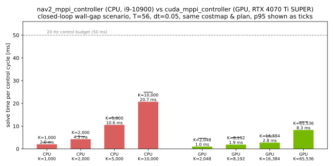

# cuda_mppi_controller vs nav2_mppi_controller (2026-06-10)

Head-to-head closed-loop comparison of the stock Nav2 MPPI controller (CPU)
and `cuda_mppi_controller` (GPU), both loaded through pluginlib exactly as
`controller_server` loads them.

## Setup

- Scenario: 10 m × 10 m costmap (0.05 m/cell), vertical lethal wall at
  x = 5 m with a 2 m gap, manually inflated (inscribed 0.2 m, scaling 3.0).
  Straight global plan from (1, 5) to (9, 5) through the gap.
- Closed loop at 20 Hz against a unicycle plant with perfect tracking;
  identical costmap, plan, control limits (`vx∈[-0.35, 0.5]`, `wz≤1.9`),
  horizon (T=56, dt=0.05), and 1 optimizer iteration for both.
- CPU baseline: `nav2_mppi_controller::MPPIController` with the stock
  nav2_bringup critic set (ConstraintCritic, CostCritic, GoalCritic,
  GoalAngleCritic, PathAlignCritic, PathFollowCritic, PathAngleCritic,
  PreferForwardCritic), otherwise default parameters.
- Hardware: benchmark CPU vs benchmark GPU. ROS 2 Jazzy,
  CUDA 12.0, Release build.



## Results

| controller | K | result | sim time to goal | mean solve | p95 | max |
|---|---:|---|---:|---:|---:|---:|
| nav2 MPPI (CPU) | 1,000 | success | 16.0 s | 3.63 ms | 5.28 ms | 17.68 ms |
| nav2 MPPI (CPU) | 2,000 | success | 16.2 s | 5.22 ms | 6.60 ms | 10.70 ms |
| nav2 MPPI (CPU) | 5,000 | success | 16.5 s | 13.20 ms | 16.62 ms | 23.13 ms |
| nav2 MPPI (CPU) | 10,000 | success | 16.2 s | 27.43 ms | 34.28 ms | 38.99 ms |
| CUDA MPPI (GPU) | 2,048 | success | 16.8 s | 2.62 ms | 5.93 ms | 8.70 ms |
| CUDA MPPI (GPU) | 8,192 | success | 16.5 s | 3.25 ms | 6.59 ms | 13.49 ms |
| CUDA MPPI (GPU) | 16,384 | success | 16.1 s | 3.92 ms | 7.45 ms | 14.31 ms |
| CUDA MPPI (GPU) | 65,536 | success | 16.0 s | 10.63 ms | 15.00 ms | 22.24 ms |

Side-by-side rollout (CPU K=2,000 vs GPU K=16,384):
[`gif/cuda_mppi_vs_nav2_cpu.gif`](../../gif/cuda_mppi_vs_nav2_cpu.gif)

## Reading the numbers honestly

- **Throughput**: at comparable sample counts (K≈2,000) the GPU solve is
  ~2× faster; K=65,536 on the GPU still costs less than K=10,000 on the
  CPU. Sample counts that are impractical on CPU are routine on GPU.
- **Quality**: time-to-goal now matches the CPU baseline (16.0–16.8 s vs
  16.0–16.5 s), and on the GPU it improves monotonically with K
  (16.8 s @ 2k → 16.0 s @ 65k) — more samples buy better trajectories,
  which is exactly the trade the GPU makes cheap. Closing the earlier
  ~15% gap took three things: an anti-windup nominal that may exceed
  v_max by one noise std (a clamped zero-mean average otherwise cruises
  ~0.4σ below the limit), a PreferForward-style speed cost, and a wz²
  damping cost against heading random walk.
- Both controllers solved well inside the 50 ms @ 20 Hz budget in this
  scenario; the GPU headroom matters for larger K, longer horizons, denser
  costmaps, or slower embedded CPUs.
- Single fixed scenario, single seed pair, no sensor pipeline — this is a
  controlled microbenchmark, not a field study.

## Reproduce

```bash
cd ros2_ws
colcon build --packages-select cuda_mppi_controller --cmake-args -DCMAKE_BUILD_TYPE=Release
source install/setup.bash
mkdir -p /tmp/mppi_bench
ros2 run cuda_mppi_controller controller_benchmark /tmp/mppi_bench
python3 scripts/render_cuda_mppi_benchmark.py /tmp/mppi_bench 2026-06-10
```
