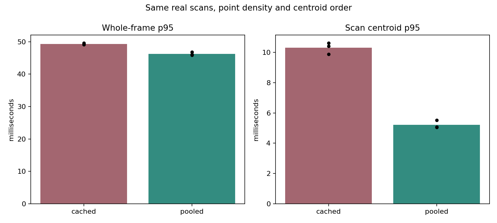

# Exact pooled scan centroids (2026-10-10)

Native GPU KISS-ICP, rolling voxel mapping, ESDF and MPPI shadow execution on timed MCD NTU day-02: 1,190 scans / 118.902 seconds. One full-route bytewise validation plus three timing replays per mode, sequentially on one NVIDIA consumer GPU at normal process priority.

All three paired comparisons passed. Scan centroid mean decreased from 7.44-7.70 to 3.74-4.01 ms, and whole-frame p95 from 49.12-49.62 to 45.88-46.85 ms. Pooled aggregation is now the default; cached/reference execution remains selectable.

[Implementation and reproduction](../kiss_icp_pooled_downsample.md), [all replay metrics](kiss_icp_downsample_2026-10-10.csv), [source/input/executable hashes and checks](kiss_icp_downsample_2026-10-10.json), [CPU raw-scan timings and allocation profile](kiss_icp_downsample_cpu_2026-10-10.csv).

| Mode / repeat | Frame mean ms | p95 ms | p99 ms | Centroids mean ms | p95 ms | ATE m | Drift % | Quality |
|---|---:|---:|---:|---:|---:|---:|---:|---|
| validate / 0 | 39.561 | 53.325 | 56.964 | 11.053 | 14.589 | 0.805742516 | 0.468232314 | PASS |
| cached / 0 | 36.021 | 49.171 | 52.017 | 7.439 | 9.880 | 0.805742516 | 0.468232314 | PASS |
| pooled / 0 | 32.203 | 45.884 | 48.803 | 3.741 | 5.081 | 0.805742516 | 0.468232314 | PASS |
| pooled / 1 | 33.106 | 46.849 | 50.821 | 4.005 | 5.522 | 0.805742516 | 0.468232314 | PASS |
| cached / 1 | 36.318 | 49.619 | 53.175 | 7.666 | 10.626 | 0.805742516 | 0.468232314 | PASS |
| cached / 2 | 36.379 | 49.123 | 52.228 | 7.701 | 10.402 | 0.805742516 | 0.468232314 | PASS |
| pooled / 2 | 32.646 | 46.031 | 49.462 | 3.819 | 5.061 | 0.805742516 | 0.468232314 | PASS |

Validate executes both methods on every deskewed scan and compares all centroid/output-order bytes. It completed without mismatches; its timing includes extra reference/comparison work and is excluded from the timing comparison and plot.

| Repeat | Centroid mean <5 ms | Centroid p95 faster | Frame p95 faster | Trajectory/map CSV equal | ATE equal | Drift equal |
|---|---|---|---|---|---|---|
| 0 | PASS | PASS | PASS | PASS | PASS | PASS |
| 1 | PASS | PASS | PASS | PASS | PASS | PASS |
| 2 | PASS | PASS | PASS | PASS | PASS | PASS |

All modes use full map-normal recomputation, exact voxel queries, block reduction, dense host map and cell-order normal scheduling. Scan voxels stay 0.22 m, map voxels 0.35 m, radius 40 m and normal support 12 neighbours. No point density, iteration, correspondence or native quality gate changed. The prior optional incremental-normal feature is not enabled in this comparison.

CSV equality covers every recorded XY pose, XY error, inlier count, map point count, observed voxel count, integrated ray count, unknown-cell count and timestamp. It is not a full-route bitwise SE(3) comparison; the streaming test separately checks full poses/alignment values bit-for-bit. Occupied cells may vary due to existing clamped atomic occupancy updates; native mapping/controller gates remain unchanged.

| Mode / repeat | New arena slabs | Frames with new slabs | Retained arena MiB | Calculated FIFO p95 ms | Frames >100 ms % | MPPI minimum valid ratio |
|---|---:|---:|---:|---:|---:|---:|
| validate / 0 | 5 | 2 | 6.00 | 53.326 | 0.000 | 0.342773 |
| cached / 0 | 0 | 0 | 0.00 | 49.171 | 0.000 | 0.342773 |
| pooled / 0 | 5 | 2 | 6.00 | 45.884 | 0.000 | 0.342773 |
| pooled / 1 | 5 | 2 | 6.00 | 46.849 | 0.000 | 0.342773 |
| cached / 1 | 0 | 0 | 0.00 | 49.619 | 0.000 | 0.342773 |
| cached / 2 | 0 | 0 | 0.00 | 49.122 | 0.000 | 0.342773 |
| pooled / 2 | 5 | 2 | 6.00 | 46.031 | 0.000 | 0.342773 |

## Raw CPU scans and allocation breakdown

The CPU probe uses 24 evenly spaced raw scans without deskew and six repeats per method per scan. It alternates cached/pooled calls and checks the complete output against the reference each time. All outputs matched; timed pooled calls allocated 0 new arena slabs after per-scan warmup.

| Method | Whole-call mean ms | p95 ms | Maximum ms |
|---|---:|---:|---:|
| cached | 7.597 | 9.724 | 12.989 |
| pooled | 3.204 | 4.488 | 5.995 |

Mean raw points: 92011.6; unique scan voxels: 39790.5; map allocator calls: 39793.5; requested node/bucket bytes: 3688940.0.

| Diagnostic stage | Mean ms |
|---|---:|
| Voxel keys | 0.654 |
| Map construction/reserve | 0.418 |
| Lookup/accumulation using precomputed keys | 4.589 |
| Centroid output | 0.428 |
| Map destruction | 1.163 |

These diagnostic stages use precomputed keys and different cache conditions from the original interleaved loop. Their sum is not the whole-call benchmark. Allocation counts include map nodes/buckets, excluding key/output vectors. Raw probes do not include GPU deskew or stack latency.

The allocator retains storage in 1 MiB multiples, constructing fresh map values each scan. The container, hasher, reserve/insertion sequence, float sums and output iteration order match the cached reference. Ordering is relative to one standard-library implementation. The output vector reserves another 2.29 MiB at the 200,000-point capacity, giving 8.29 MiB of retained backing memory on this route; arena counts exclude the output and small metadata. Memory remains until object destruction, including across reset. No extra GPU storage is added.

Maximum frame time in repeat 2 increased from 55.03 to 61.06 ms. The paired improvement is in p95, and every-frame bounds remain unestablished.

Frame time covers odometry, rolling mapping, projection, ESDF and MPPI every tenth scan. Loading, writes and construction are excluded. Commands are not applied; FIFO metrics calculate serial lossless replay rather than observed ROS scheduling or sensor-to-command latency. Three timing repeats on one route do not establish performance across datasets/hardware, controller robustness or every-frame bounds.

Focused CTest checks passed 7/7 (five GPU, two CPU); CPU/Python checks passed 82/82 before timing. All seven full-route runs and the CPU probe are retained. No builds, tests or other GPU workloads were intentionally run during GPU timing. The earlier 12-scan development probe is preserved in `build/kiss_pool_20261010/cpu_probe.csv` with source/executable snapshots in `build/kiss_pool_20261010/probe_sources/`; it is not part of the final paired comparison.

Raw per-frame CSVs, logs, commands, metrics and frozen source/executable snapshots are in `build/kiss_pool_20261010/final/`. The measured worktree was uncommitted: recorded HEAD is the base commit. Normalized source hashes bind the implementation, and raw-byte hashes bind input and executables.
