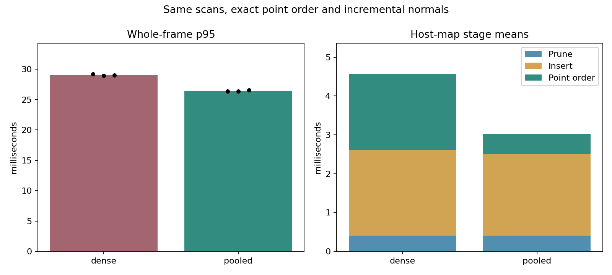

# Exact pooled host-map results (2026-10-10)

Native timed MCD NTU day-02 shadow replay: 1,190 scans / 118.902 seconds on one NVIDIA consumer GPU. One full-route point/order/normal validation, three alternating Dense/Pooled timing pairs and one default-policy replay, sequentially at normal Windows process priority.

All three paired performance/equality checks and the default-policy checks passed. Whole-frame p95 decreased from 28.94-29.19 to 26.37-26.56 ms (8.5-9.6%). Map-update mean decreased from 4.68-4.73 to 3.15-3.20 ms (31.8-33.4%). Point-order export decreased from about 1.94-1.98 to 0.52-0.53 ms. The shared API and native runner now default to the pooled host map.

[Implementation and reproduction](../kiss_icp_pooled_host_map.md), [all replay metrics](kiss_icp_host_map_2026-10-10.csv), [hashes, commands and checks](kiss_icp_host_map_2026-10-10.json).

| Mode / repeat | Frame mean ms | p95 ms | p99 ms | Max ms | Map mean ms | Map order mean ms | Quality |
|---|---:|---:|---:|---:|---:|---:|---|
| validate / 0 | 36.788 | 52.296 | 54.761 | 59.645 | 7.747 | 0.526 | PASS |
| dense / 0 | 22.331 | 29.186 | 31.597 | 37.253 | 4.731 | 1.981 | PASS |
| pooled / 0 | 20.633 | 26.377 | 28.154 | 36.950 | 3.151 | 0.519 | PASS |
| pooled / 1 | 20.783 | 26.372 | 28.514 | 30.581 | 3.159 | 0.526 | PASS |
| dense / 1 | 22.229 | 28.944 | 30.979 | 35.278 | 4.710 | 1.964 | PASS |
| dense / 2 | 22.278 | 29.025 | 31.006 | 33.552 | 4.682 | 1.935 | PASS |
| pooled / 2 | 20.802 | 26.564 | 28.276 | 33.991 | 3.195 | 0.531 | PASS |
| default / 0 | 20.839 | 26.509 | 28.212 | 31.103 | 3.182 | 0.524 | PASS |

Paired whole-frame p95 savings: 2.808 ms, 2.572 ms, 2.460 ms.
All pairs reach the stated 2 ms target: True.

Validate compares every host map coordinate bit and exported slot against standard Dense on the same world points, and every incremental normal against full GPU recomputation. It completed without mismatches; its extra reference work is excluded from timing pairs. The default replay omits the map-backend flag and verifies the actual pooled policy and matching recorded trajectory/map/reuse outputs.

Timing pairs keep pooled scan centroids, incremental normals, voxel queries, block reduction and cell-order normal scheduling fixed. Scan/map voxels remain 0.22/0.35 m, radius 40 m, normal support 12 neighbours and map capacity 200,000 points. Point density and ICP/correspondence limits do not change. Complete SE3 poses and alignment values are compared in the separate streaming tests; full-route CSV equality covers the recorded XY trajectory/map fields and per-frame normal reuse/recompute counts.

Occupancy counts can differ due to existing clamped atomic updates. Different occupied-cell frame counts are retained in JSON; native mapping/controller gates apply independently.

The pooled map retains 5.00 MiB of node slabs on this route, replacing individual host hash-node allocations. Two integer link arrays add 1.53 MiB at the configured capacity. Node slabs follow the concurrent-node high-water mark and remain across reset; after the map shrinks, retained peak storage and slab slack can exceed standard allocation. Bucket arrays, dense coordinates/order, normal-cache storage and small metadata are excluded from these figures. No GPU storage is added. Validate also holds the extra reference map and normal scratch.

Focused CTest passed 7/7; CPU/Python CTest passed 82/82; the Linux GCC host-map test passed with AddressSanitizer and UndefinedBehaviorSanitizer. Checks completed before timing. Raw inputs/executable use byte SHA-256; frozen sources use normalized-LF SHA-256. Recorded HEAD is the base of the measured uncommitted worktree, and the frozen hashes bind the actual implementation. Published plotting bytes match the retained benchmark plot.

Raw evidence is retained in `build/kiss_host_map_20261010/final/`; build/test logs and the publication generator are in its parent. Preliminary pool-only and compact-order experiments remain separately in `trial/` and `order_trial/` with their own frozen sources/executables.

Frame timing covers odometry, rolling mapping and projection/ESDF/MPPI every tenth scan. Loading, output writes and construction are excluded. Commands are not applied. FIFO numbers calculate serial lossless replay rather than observed ROS scheduling or sensor-to-command latency. One route/hardware result does not establish a universal speedup or a worst-frame bound. The maximum frame in pair 2 increased from 33.552 to 33.991 ms despite its improved p95/p99; all maximum values are retained above.
