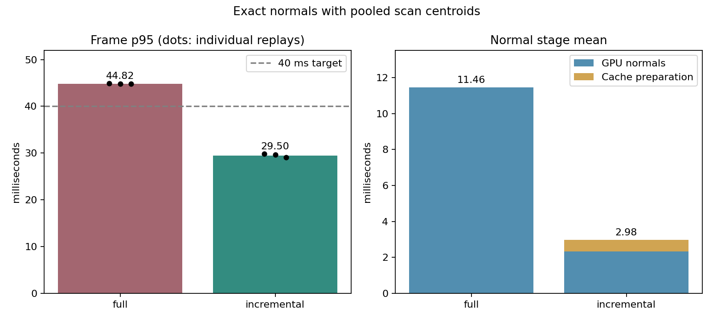

# Pooled centroids with default incremental normals (2026-10-10)

Native GPU KISS-ICP, rolling voxel mapping, ESDF and MPPI shadow execution on timed MCD NTU day-02: 1,190 scans / 118.902 seconds. One full-route bitwise normal validation, three alternating timing pairs and one default-policy verification replay, sequentially on one NVIDIA consumer GPU at normal Windows process priority.

All three paired checks and the default-policy checks passed. Whole-frame p95 decreased from 44.76-44.85 to 29.07-29.81 ms (33.5-35.1% reduction). The shared API and native runner now default to Incremental normal updates with Pooled scan centroids.

[Implementation and reproduction](../kiss_icp_incremental_normals.md), [all replay metrics](kiss_icp_normal_default_2026-10-10.csv), [source/input/executable hashes and checks](kiss_icp_normal_default_2026-10-10.json).



The published chart is regenerated from recorded metrics with extra axis space and separated replay dots. The original benchmark plot remains in the raw evidence; both plot hashes and the report-generator hash are recorded in the JSON.

| Mode / repeat | Frame mean ms | p95 ms | p99 ms | Maximum ms | GPU normals mean ms | Cache prepare mean ms | Reused | ATE m | Quality |
|---|---:|---:|---:|---:|---:|---:|---:|---:|---|
| validate / 0 | 34.088 | 47.947 | 50.555 | 52.391 | 2.332 | 0.634 | 94.36% | 0.805742516 | PASS |
| full / 0 | 31.041 | 44.855 | 47.871 | 54.721 | 11.456 | 0.000 | 0.00% | 0.805742516 | PASS |
| incremental / 0 | 22.745 | 29.808 | 31.853 | 34.733 | 2.343 | 0.648 | 94.36% | 0.805742516 | PASS |
| incremental / 1 | 22.783 | 29.633 | 31.701 | 35.033 | 2.342 | 0.640 | 94.36% | 0.805742516 | PASS |
| full / 1 | 31.074 | 44.849 | 47.325 | 50.615 | 11.468 | 0.000 | 0.00% | 0.805742516 | PASS |
| full / 2 | 30.935 | 44.760 | 47.425 | 50.467 | 11.462 | 0.000 | 0.00% | 0.805742516 | PASS |
| incremental / 2 | 22.422 | 29.072 | 31.122 | 33.573 | 2.346 | 0.618 | 94.36% | 0.805742516 | PASS |
| default / 0 | 22.670 | 29.468 | 31.363 | 32.911 | 2.345 | 0.635 | 94.36% | 0.805742516 | PASS |

Validate computes both incremental and full map normals every frame and compares all three float bits at every map point. It completed without mismatches. Its timing includes extra full-normal/comparison work and is excluded from the timing plot and paired checks. The separate default replay omits both centroid-backend and normal-update flags and verifies the actual policies, real reuse, frame p95 below 40 ms and matching recorded outputs/ATE/drift against explicit incremental execution. It is also excluded from the paired plot.

| Repeat | Incremental p95 <40 ms | Faster than Full | Trajectory/map CSV equal | ATE equal | Drift equal | Occupied-cell different frames |
|---|---|---|---|---|---|---:|
| 0 | PASS | PASS | PASS | PASS | PASS | 88 |
| 1 | PASS | PASS | PASS | PASS | PASS | 88 |
| 2 | PASS | PASS | PASS | PASS | PASS | 89 |

Both timing modes explicitly use pooled scan centroids, exact voxel queries, block reduction, dense host map and cell-order normal scheduling. Scan/map voxels stay 0.22/0.35 m, map radius 40 m, normal support 12 neighbours and map capacity 200,000 points. No density, ICP limit, correspondence or native quality gate changed. ATE is 0.805742516 m and drift 0.468232314% in all eight runs.

CSV equality covers every recorded XY pose, XY error, inliers, map points, observed voxels, integrated rays, unknown cells and timestamp. Full-route normal validation checks bits independently; the streaming tests separately compare full poses and alignment values bit-for-bit, including movement and reset. Occupied-cell counts can differ due to existing clamped atomic occupancy updates, even across Full repeats; the JSON retains those differences and native mapping/controller gates still apply.

## Memory and workload limits

At the configured capacity the incremental cache adds 38.23 MiB of fixed GPU storage plus CUB scan scratch, and 3.05 MiB of reserved host integer storage. Validate adds 2.29 MiB of GPU scratch. Allocation happens during construction. Shared map/index/upload buffers are unchanged. Pooled centroid storage also remains as in the preceding comparison: 6 MiB of arena backing on this route plus 2.29 MiB of reserved output, excluding small metadata.

Select `--kiss-normal-update full` or `KissIcpNormalUpdate::Full` to disable cache storage and maintenance. Other map/normal backend combinations execute the existing full path. Tied/incomplete support, lost selected neighbours, new nearby points and large invalidation searches recompute conservatively. Rapid map turnover or sparse/tie-heavy clouds can reuse less; one route does not establish a speedup for every workload.

## Reproduction and retained evidence

```bash
python scripts/benchmark_kiss_icp_normals.py \
  --sequence build/cudanav_real_gpu_stack_release_724d05ca/sequence.bin \
  --out-dir build/kiss_icp_normal_default_comparison --repeats 3 \
  --downsample-backend pooled --verify-default --plot
```

Build/CTest commands and Windows DLL-path handling are in the implementation guide. The benchmark refuses to overwrite its output directory and freezes the executable, computation/benchmark/test sources and CMake configuration. Sources use normalized-LF SHA-256; input and executables use raw-byte SHA-256. Recorded HEAD is the base of the measured uncommitted worktree; frozen source hashes bind the actual implementation.

Focused CTest passed 7/7 (five GPU, two CPU); CPU/Python CTest passed 82/82 before timing. No builds, tests or other GPU workloads were intentionally run during timing. Raw per-frame CSVs, metrics, logs, exact commands and frozen sources/executable are retained in `build/kiss_default_20261010/final/`; pre-timing check logs are in its parent directory.

The preceding diagnostic pair and two confirmation pairs remain in `build/kiss_next_20261010/combination/` and `build/kiss_next_20261010/combination_repeats/`. They are separate from this formal comparison. The [earlier cached-centroid comparison](kiss_icp_normals_2026-10-10.md) retains its inconsistent latency checks and original opt-in decision; its measurements and source hashes are unchanged.

Frame time covers odometry, rolling mapping, projection, ESDF and MPPI every tenth scan. Loading, writes and construction are excluded. Commands are not applied; FIFO metrics calculate serial lossless replay rather than observed ROS scheduling or sensor-to-command latency. The p95 gain does not bound every frame or establish controller robustness across routes/hardware.
