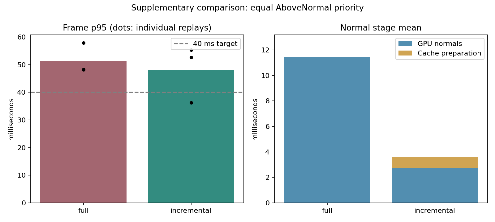

# Exact incremental map normals (2026-10-10)

Native GPU KISS-ICP, rolling voxel mapping, ESDF and MPPI shadow execution on timed MCD NTU day-02: 1,190 scans / 118.902 seconds. Initial normal-priority comparison: two timing replays per mode. Supplementary comparison: three timing replays per mode at the same Windows AboveNormal process priority. Both phases include full-route bitwise validation and run sequentially on one NVIDIA consumer GPU.

[Implementation and reproduction](../kiss_icp_incremental_normals.md), [all replay metrics](kiss_icp_normals_2026-10-10.csv), [source/input/executable hashes and checks](kiss_icp_normals_2026-10-10.json).

The plot shows the supplementary AboveNormal comparison. The following table retains every initial and supplementary replay.

| Phase / mode / repeat | Frame mean ms | p95 ms | p99 ms | GPU normals mean ms | Cache prepare mean ms | Reused | ATE m | Quality |
|---|---:|---:|---:|---:|---:|---:|---:|---|
| initial / validate / 0 | 38.457 | 52.603 | 56.413 | 2.337 | 0.679 | 94.36% | 0.805742516 | PASS |
| initial / full / 0 | 44.009 | 60.836 | 69.693 | 11.565 | 0.000 | 0.00% | 0.805742516 | PASS |
| initial / incremental / 0 | 27.706 | 37.390 | 43.018 | 2.491 | 0.684 | 94.36% | 0.805742516 | PASS |
| initial / incremental / 1 | 33.480 | 54.098 | 62.080 | 2.710 | 0.843 | 94.36% | 0.805742516 | PASS |
| initial / full / 1 | 37.012 | 50.893 | 55.148 | 11.470 | 0.000 | 0.00% | 0.805742516 | PASS |
| controlled / validate / 0 | 45.825 | 66.198 | 71.465 | 2.339 | 0.931 | 94.36% | 0.805742516 | PASS |
| controlled / full / 0 | 40.255 | 57.937 | 61.354 | 11.508 | 0.000 | 0.00% | 0.805742516 | PASS |
| controlled / incremental / 0 | 27.585 | 36.294 | 41.220 | 2.475 | 0.688 | 94.36% | 0.805742516 | PASS |
| controlled / incremental / 1 | 39.884 | 55.323 | 59.865 | 3.112 | 1.014 | 94.36% | 0.805742516 | PASS |
| controlled / full / 1 | 35.544 | 48.253 | 51.983 | 11.464 | 0.000 | 0.00% | 0.805742516 | PASS |
| controlled / full / 2 | 35.448 | 48.138 | 51.425 | 11.466 | 0.000 | 0.00% | 0.805742516 | PASS |
| controlled / incremental / 2 | 31.525 | 52.615 | 56.616 | 2.669 | 0.815 | 94.36% | 0.805742516 | PASS |

Validation executes both incremental and full normals each frame and compares every map normal's three floats bit-for-bit. It completed without mismatches; its whole-frame duration includes extra reference work and is excluded from the timing comparison and plot.

Decision: incremental updates remain opt-in. The final config and native runner default to Full because whole-frame p95 improvement and the 40 ms target were not consistent. GPU normal cost fell substantially, but one supplementary incremental run also had higher whole-frame mean than its full-mode pair. This is a verified stage optimization, not a demonstrated default end-to-end latency improvement.

Initial comparison: incremental p95 was 37.390 / 54.098 ms versus full 60.836 / 50.893 ms. The second pair missed both the 40 ms target and relative p95 improvement. Mean CPU scan aggregation varied from 7.31 to 10.93 ms across timing runs. These results are retained; they do not establish a normal-priority p95 win in every repeat. Supplementary process priority was selected before running all three additional pairs; no initial run was replaced.

Supplementary paired checks:

| Repeat | Incremental p95 <40 ms | Faster than full | Trajectory/map CSV equal | ATE equal | Drift equal |
|---|---|---|---|---|---|
| 0 | PASS | PASS | PASS | PASS | PASS |
| 1 | FAIL | FAIL | PASS | PASS | PASS |
| 2 | FAIL | FAIL | PASS | PASS | PASS |

CSV equivalence compares every frame's estimated XY, XY error, inliers, map points, observed voxels, integrated rays, unknown cells and timestamps at exported precision. It does not compare complete SE(3) pose bits over the full route; the cache streaming test separately checks complete pose and alignment values bit-for-bit. Initial odometry comparisons also had zero differences in these fields.

The initial script also gated occupied-cell equality and reported failures. Full-vs-full execution differed in 79 frames, including frame zero before normals were computed; full-vs-incremental differed in 86 / 82 frames. Existing clamped atomic occupancy updates depend on update order. The supplementary benchmark records those differences separately while retaining unchanged native mapping/controller quality gates. Initial check results and all raw outputs remain preserved.

| Phase / mode / repeat | Normal GPU p95 ms | Prepare p95 ms | Reused points | Recomputed points | Inliers minimum | Drift % |
|---|---:|---:|---:|---:|---:|---:|
| initial / validate / 0 | 3.632 | 1.043 | 99995883 | 5972888 | 25004 | 0.468232314 |
| initial / full / 0 | 19.596 | 0.000 | 0 | 105968771 | 25004 | 0.468232314 |
| initial / incremental / 0 | 3.895 | 1.100 | 99995883 | 5972888 | 25004 | 0.468232314 |
| initial / incremental / 1 | 4.532 | 1.646 | 99995883 | 5972888 | 25004 | 0.468232314 |
| initial / full / 1 | 19.526 | 0.000 | 0 | 105968771 | 25004 | 0.468232314 |
| controlled / validate / 0 | 3.647 | 1.659 | 99995883 | 5972888 | 25004 | 0.468232314 |
| controlled / full / 0 | 19.516 | 0.000 | 0 | 105968771 | 25004 | 0.468232314 |
| controlled / incremental / 0 | 3.887 | 1.080 | 99995883 | 5972888 | 25004 | 0.468232314 |
| controlled / incremental / 1 | 5.763 | 1.647 | 99995883 | 5972888 | 25004 | 0.468232314 |
| controlled / full / 1 | 19.598 | 0.000 | 0 | 105968771 | 25004 | 0.468232314 |
| controlled / full / 2 | 19.614 | 0.000 | 0 | 105968771 | 25004 | 0.468232314 |
| controlled / incremental / 2 | 4.869 | 1.637 | 99995883 | 5972888 | 25004 | 0.468232314 |

GPU normal events include invalidation, reused copies, recomputed KNN/PCA and the block counter. Preparation includes remapping, transfers, the added-point index and CPU cache commit; the counter read is included in whole-frame timing. Map update includes predecessor metadata maintenance. These stages are nested inside odometry wall time.

| Phase / mode / repeat | Calculated FIFO p95 ms | Calculated deadline miss % | Frames >100 ms % | Minimum MPPI valid ratio | All-colliding evaluations |
|---|---:|---:|---:|---:|---:|
| initial / validate / 0 | 52.603 | 0.000 | 0.000 | 0.342773 | 0 |
| initial / full / 0 | 60.836 | 0.000 | 0.000 | 0.342773 | 0 |
| initial / incremental / 0 | 37.390 | 0.000 | 0.000 | 0.342773 | 0 |
| initial / incremental / 1 | 54.098 | 0.000 | 0.000 | 0.342773 | 0 |
| initial / full / 1 | 50.893 | 0.000 | 0.000 | 0.342773 | 0 |
| controlled / validate / 0 | 66.198 | 0.000 | 0.000 | 0.342773 | 0 |
| controlled / full / 0 | 57.937 | 0.000 | 0.000 | 0.342773 | 0 |
| controlled / incremental / 0 | 36.294 | 0.000 | 0.000 | 0.342773 | 0 |
| controlled / incremental / 1 | 55.323 | 0.000 | 0.000 | 0.342773 | 0 |
| controlled / full / 1 | 48.253 | 0.000 | 0.000 | 0.342773 | 0 |
| controlled / full / 2 | 48.137 | 0.000 | 0.000 | 0.342773 | 0 |
| controlled / incremental / 2 | 52.615 | 0.000 | 0.000 | 0.342773 | 0 |

Both modes use exact voxel queries, block reduction, dense host map, cached scan centroids and cell-order normal scheduling. Scan voxels stay 0.22 m, map voxels 0.35 m, radius 40 m, normal support 12 neighbours and map capacity 200,000 points. No density, iteration, correspondence or quality gate was relaxed.

The extra fixed cache storage is 38.23 MiB on the GPU plus CUB scan scratch and 3.05 MiB of reserved host metadata. Validate adds 2.29 MiB GPU scratch. Incomplete or tied support, lost selected neighbours, newly added points at/inside the support radius, and large invalidation searches recompute. The benefit depends on how much of the map survives unchanged; this route reused about 94.4%.

Frame timing covers odometry, mapping, occupancy projection, ESDF and MPPI every tenth scan. Input loading, output writes and construction are excluded. Commands are not applied. FIFO metrics calculate lossless serial replay from sensor timestamps, not observed ROS scheduling or sensor-to-command latency. Replays on one route do not establish performance across datasets/hardware or controller robustness. Supplementary runs use AboveNormal process priority; they are not normal-priority default latency. p95 does not bound every frame.

Focused CTest checks passed 7/7 (five GPU, two CPU); CPU/Python checks passed 82/82 before timing and after reverting defaults to Full. Both measured full-route validations and all ten timing replays are retained. Final rebuilt default-mode and Validate-mode full-route verification also passed, with equal recorded odometry/map outputs; default mode reused zero normals. Its executable/source hashes are recorded separately. No other builds, tests or GPU workloads were intentionally run during timing. Native host scheduling can vary.

The preceding development validation is preserved in `build/kiss_normal_20261010/prototype/`, including frozen sources/executable. It omitted CPU cache-commit time from the preparation stage (whole-frame timing included it); the final measurement includes it. The prototype is not part of the paired timing results. No failed final replay is discarded.

Raw per-frame CSV, JSON, logs, exact commands, frozen executable and source snapshots are in `build/kiss_normal_20261010/final/` (initial) and `build/kiss_normal_20261010/controlled/` (supplementary). Recorded HEAD is the base commit of the measured uncommitted worktree; normalized source hashes bind each measured implementation. The core and executable are identical between phases; only the benchmark priority option and comparison scope changed. After timing, the config/runner defaults changed from Incremental to Full; every benchmark mode was explicitly selected, and the cache algorithm is unchanged. Final source hashes are recorded separately from measured hashes. Input and executable hashes use raw bytes.
