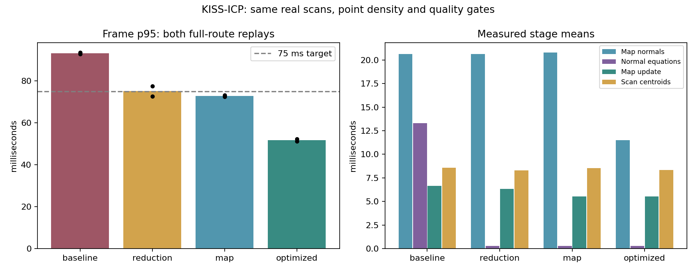

# KISS-ICP pipeline optimization (2026-10-10)

Native GPU KISS-ICP, rolling voxel mapping, ESDF and MPPI shadow execution on the timed MCD NTU day-02 sequence: 1,190 frames / 118.902 seconds. Two replays per method on the same route, not independent datasets. GPU: NVIDIA consumer GPU.

[Implementation and reproduction](../kiss_icp_pipeline_performance.md), [all replay metrics](kiss_icp_pipeline_2026-10-10.csv), [source/executable/input hashes and quality gates](kiss_icp_pipeline_2026-10-10.json).

| Method / repeat | Frame mean ms | p95 ms | p99 ms | ATE m | Drift % | Quality |
|---|---:|---:|---:|---:|---:|---|
| baseline / 0 | 61.537 | 92.765 | 102.066 | 0.8137 | 0.4744 | PASS |
| reduction / 0 | 47.407 | 72.621 | 83.527 | 0.8057 | 0.4682 | PASS |
| map / 0 | 47.598 | 73.182 | 86.380 | 0.8057 | 0.4682 | PASS |
| optimized / 0 | 37.745 | 52.227 | 67.655 | 0.8057 | 0.4682 | PASS |
| optimized / 1 | 38.158 | 51.191 | 56.606 | 0.8057 | 0.4682 | PASS |
| map / 1 | 47.243 | 72.349 | 87.002 | 0.8057 | 0.4682 | PASS |
| reduction / 1 | 47.618 | 77.481 | 85.896 | 0.8057 | 0.4682 | PASS |
| baseline / 1 | 61.855 | 93.544 | 102.697 | 0.8045 | 0.4656 | PASS |

| Repeat | Optimized p95 <75 ms | Faster than baseline | ATE within +2 cm | Drift within +0.02 pp |
|---|---|---|---|---|
| 0 | PASS | PASS | PASS | PASS |
| 1 | PASS | PASS | PASS | PASS |

| Method / repeat vs reduction / 0 | Different estimated X frames | Different estimated Y frames | Different inlier-count frames | Different map-count frames |
|---|---:|---:|---:|---:|
| reduction / 0 | 0 | 0 | 0 | 0 |
| map / 0 | 0 | 0 | 0 | 0 |
| optimized / 0 | 0 | 0 | 0 | 0 |
| optimized / 1 | 0 | 0 | 0 | 0 |
| map / 1 | 0 | 0 | 0 | 0 |
| reduction / 1 | 0 | 0 | 0 | 0 |

Full-route equivalence compares each frame at exported CSV precision; it is not a bitwise comparison of the complete SE(3) pose. The 20-frame streaming test separately compares complete poses bit-for-bit.

| Method / repeat | Normal queries mean ms | Normal equations mean ms | Scan centroids mean ms | Map prune mean ms | Map insert mean ms | Map pack mean ms | GPU reorder mean ms | Map upload wall mean ms |
|---|---:|---:|---:|---:|---:|---:|---:|---:|
| baseline / 0 | 20.636 | 13.245 | 8.475 | 2.606 | 2.077 | 1.859 | 0.000 | 0.160 |
| reduction / 0 | 20.639 | 0.287 | 8.268 | 2.480 | 1.948 | 1.644 | 0.000 | 0.173 |
| map / 0 | 20.810 | 0.288 | 8.589 | 0.478 | 2.736 | 2.187 | 0.081 | 0.433 |
| optimized / 0 | 11.494 | 0.288 | 8.267 | 0.467 | 2.608 | 2.171 | 0.081 | 0.437 |
| optimized / 1 | 11.494 | 0.288 | 8.439 | 0.482 | 2.760 | 2.141 | 0.083 | 0.443 |
| map / 1 | 20.811 | 0.287 | 8.504 | 0.480 | 2.644 | 2.104 | 0.080 | 0.428 |
| reduction / 1 | 20.627 | 0.289 | 8.356 | 2.489 | 2.039 | 1.645 | 0.000 | 0.156 |
| baseline / 1 | 20.617 | 13.332 | 8.705 | 2.548 | 2.080 | 1.765 | 0.000 | 0.160 |

GPU normal-equation time is within ICP wall time; prune/insert/pack are within map-update wall time; GPU reorder is within map-upload wall time. Nested times must not be added to their parent.

| Method / repeat | Calculated FIFO p95 response ms | Calculated final response ms | Calculated deadline miss % | Frames over 100 ms % | Minimum MPPI valid ratio |
|---|---:|---:|---:|---:|---:|
| baseline / 0 | 92.895 | 154.211 | 1.849 | 1.429 | 0.612305 |
| reduction / 0 | 72.621 | 80.226 | 0.084 | 0.168 | 0.342773 |
| map / 0 | 73.215 | 74.902 | 0.840 | 0.504 | 0.342773 |
| optimized / 0 | 52.227 | 55.523 | 0.000 | 0.084 | 0.342773 |
| optimized / 1 | 51.191 | 53.952 | 0.000 | 0.000 | 0.342773 |
| map / 1 | 72.572 | 81.070 | 0.084 | 0.084 | 0.342773 |
| reduction / 1 | 77.481 | 78.138 | 0.000 | 0.000 | 0.342773 |
| baseline / 1 | 93.943 | 93.965 | 2.689 | 1.849 | 0.532715 |

FIFO metrics calculate lossless serial replay at original sensor timestamps; they are not observed ROS scheduling or sensor-to-command latency. Frame timing excludes input loading, CSV output and object construction. MPPI is evaluated every tenth scan and commands are not applied. The p95 target is not a bound on every frame.

Baseline uses atomic assembly, unordered host map, uncached centroids and input-order normal queries. Reduction changes assembly only; map additionally changes host point storage while exporting the reference point order for GPU gathering; optimized additionally caches adjacent scan voxel values and schedules normal queries by cell. Input point density, 0.22 m scan voxels, 0.35 m map voxels, 40 m radius, 12 normal neighbours and ICP limits are unchanged. The earlier ordered-map experiment below isolates caching without the cell schedule. The final optimized comparison combines both changes; it does not isolate their effects on frame wall time.

Block reduction changes floating-point addition order relative to atomic assembly. It uses 91.6 KiB of default GPU scratch. The dense host map uses contiguous point and order buffers (3.05 MiB reserved at the default 200,000-point capacity), plus 3.05 MiB GPU gathering scratch; host hash nodes/buckets remain. Dense and unordered maps preserve exact GPU point order for the same world-point inputs, tested together with bit-identical streaming poses and alignment values.

All eight final replays are retained. Earlier development experiments are also retained: `build/kiss_host_20261010/final/` tested a flat host voxel table and missed the 75 ms target (optimized p95 80.965 / 85.437 ms); it was removed because mean scan aggregation regressed. `build/kiss_host_20261010/dense_final/` tested direct dense GPU point order: all four dense-map runs failed the unchanged MPPI valid-ratio gate, and one of two atomic baselines also failed. The implementation now gathers points in reference order. `build/kiss_host_20261010/ordered_final/` then passed all eight quality gates but missed the paired 75 ms target on one optimized replay (p95 68.859 / 87.564 ms), before cell scheduling was added. Prototype source snapshots/patches are in `build/kiss_host_20261010/prototype_sources/`, `build/kiss_host_20261010/order_prototype_sources/` and `build/kiss_host_20261010/preserved_order_sources/`. No gate was relaxed. Two replays on one route do not establish controller robustness or real-vehicle performance.

Checks before final timing: focused GPU/CPU CTest checks pass (6/6: four GPU, two CPU); CPU/Python labelled CTest checks pass (82/82, including the two new CPU tests). Full methods run sequentially in forward then reverse order using one frozen executable, with no concurrent tests or GPU workloads intentionally run. Timings can vary with host scheduling/load.

Normal cell scheduling reuses the existing index permutation, requiring no additional sort or buffer. It changes query thread assignment while preserving neighbour IDs, arithmetic order and output positions. Exact query tests compare input/cell schedules and exhaustive neighbours; streaming tests also compare poses and alignment values bit-for-bit.

Raw per-frame CSVs, commands, logs, results and comparison plot: `build/kiss_host_20261010/cell_final/`. The measured implementation was an uncommitted worktree: the recorded HEAD is the base commit and does not contain these changes. Normalized source hashes bind the measured implementation; executable and input hashes use raw bytes.
