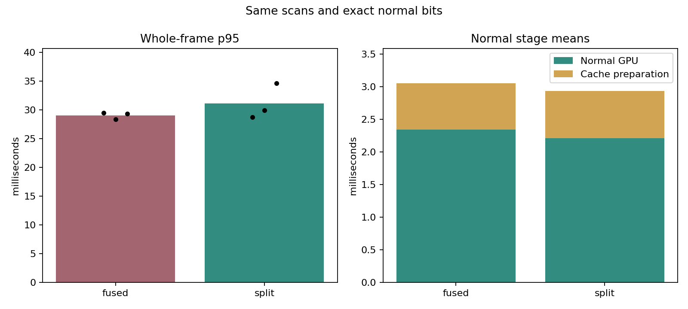

# Exact split normal scheduling results (2026-10-10)

Native timed MCD NTU day-02 shadow replay: 1,190 scans / 118.902 seconds on one NVIDIA consumer GPU. One full-route bitwise validation, three alternating Fused/Split timing pairs and one default-policy replay, sequentially at normal Windows process priority.

Split reduces mean GPU normal work by 0.075-0.171 ms (3.2-7.3%) across three pairs. Whole-frame p95 improves in 1/3 pairs, so a consistent whole-frame latency benefit is not established. The 1 ms saving target is achieved in every pair: False. Fused remains the default; Split is selectable for workload-specific evaluation.

[Implementation and reproduction](../kiss_icp_split_normals.md), [all metrics](kiss_icp_split_normals_2026-10-10.csv), [hashes and checks](kiss_icp_split_normals_2026-10-10.json).

Left bars average the per-replay p95 values; dots show all three repeats. Right bars average GPU normal and cache-preparation stage means.

| Mode / repeat | Frame mean ms | p95 ms | p99 ms | Max ms | Normal mean ms | Cache preparation mean ms | Quality |
|---|---:|---:|---:|---:|---:|---:|---|
| validate / 0 | 42.822 | 68.613 | 75.923 | 95.814 | 2.161 | 0.811 | PASS |
| fused / 0 | 22.292 | 29.494 | 32.642 | 34.992 | 2.345 | 0.710 | PASS |
| split / 0 | 21.858 | 28.724 | 33.024 | 39.166 | 2.174 | 0.701 | PASS |
| split / 1 | 22.224 | 29.922 | 33.013 | 37.989 | 2.179 | 0.702 | PASS |
| fused / 1 | 21.737 | 28.391 | 31.187 | 35.259 | 2.343 | 0.692 | PASS |
| fused / 2 | 22.380 | 29.311 | 33.189 | 37.778 | 2.344 | 0.720 | PASS |
| split / 2 | 24.095 | 34.619 | 40.270 | 72.072 | 2.269 | 0.781 | PASS |
| default / 0 | 22.462 | 29.376 | 32.425 | 35.168 | 2.347 | 0.712 | PASS |

Paired whole-frame p95 savings (negative means slower): 0.770 ms, -1.531 ms, -5.308 ms.
All pairs reach the stated 1 ms saving target: False.

Full-route validation compares all map coordinate/order bits and every split normal against the standard map and full GPU recomputation. Validation timing includes that extra reference work and is excluded from timing pairs. Every native quality gate and paired recorded trajectory/map/reuse check is retained in JSON, including failures.

Timing pairs fix pooled maps/centroids, exact voxel queries, block reduction, cell query order and incremental updates. Scan/map voxels remain 0.22/0.35 m, radius 40 m, K=12 and map capacity 200,000. Split adds 800,004 bytes (0.763 MiB) of device queue storage; Fused and Full allocate no queue. No extra host storage or per-frame allocation. The default replay omits the schedule override and checks the recorded policy and matching trajectory/map/reuse fields.

The benchmark exits 1 because two whole-frame p95 comparisons fail; correctness and native quality checks pass. Focused CTest passed 7/7, CPU/Python CTest passed 82/82 and GPU Compute Sanitizer memcheck reported zero errors. These checks completed before timing. The GPU test compares full SE3 poses/alignment statistics for moving clouds, reset, K=1/12/20, ties, both query orders, empty/full queues and partial blocks. Full-route CSV equality covers recorded XY poses/map/reuse fields. Occupied-cell differences from existing clamped atomic mapping are recorded separately; native mapping/controller gates apply independently.

Frozen computation/benchmark/test sources use normalized-LF SHA-256. Raw inputs/executable/logs use byte SHA-256. Recorded HEAD is the base of the measured uncommitted worktree; source snapshots bind the measured implementation. Raw evidence is in build/kiss_split_normals_20261010/final/. Grid-stride diagnostic logs and separate frozen split-only, bounded-query and runtime-branch trials remain in the parent directory.

Frame timing covers odometry and rolling mapping, with occupancy projection/ESDF/MPPI every tenth scan. Commands are unapplied; loading, construction and output are excluded. FIFO values calculate serial lossless replay rather than observed ROS scheduling or sensor-to-command latency. One route/hardware does not establish a universal speedup or a worst-frame bound. Low-reuse workloads can pay extra compaction/launch costs.
