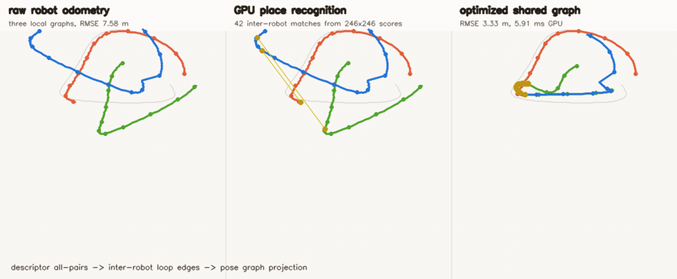
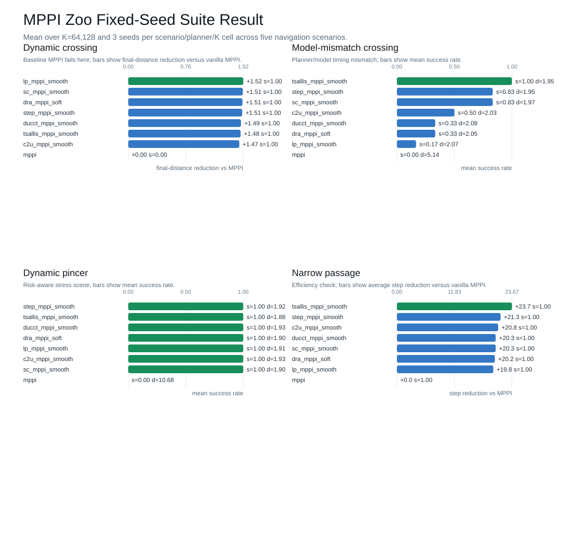

# CudaRobotics

[](https://github.com/rsasaki0109/CudaRobotics/stargazers)
[](https://developer.nvidia.com/cuda-toolkit)
[](https://rsasaki0109.github.io/CudaRobotics/)

<p align="center">
  <a href="https://rsasaki0109.github.io/CudaRobotics/gpu_mppi_racing.gif">
    
  </a>
  <a href="https://rsasaki0109.github.io/CudaRobotics/comparison_expansion_reset_mcl.gif">
    
  </a>
  <a href="https://rsasaki0109.github.io/CudaRobotics/gpu_multi_robot_planner.gif">
    
  </a>
  <a href="https://rsasaki0109.github.io/CudaRobotics/gpu_diffusion_planner.gif">
    
  </a>
  <a href="gif/gpu_multi_robot_place_graph_slam.gif">
    
  </a>
</p>

<p align="center">
  <a href="https://rsasaki0109.github.io/CudaRobotics/gpu_mppi_racing.gif">MPPI racing</a>
  /
  <a href="https://rsasaki0109.github.io/CudaRobotics/comparison_expansion_reset_mcl.gif">Expansion-reset MCL</a>
  /
  <a href="https://rsasaki0109.github.io/CudaRobotics/gpu_multi_robot_planner.gif">Multi-robot planner</a>
  /
  <a href="https://rsasaki0109.github.io/CudaRobotics/gpu_diffusion_planner.gif">Diffusion planner</a>
  /
  <a href="gif/gpu_multi_robot_place_graph_slam.gif">Multi-robot place graph SLAM</a>
  /
  <a href="https://rsasaki0109.github.io/CudaRobotics/gpu_gaussian_splatting_slam.gif">Gaussian-Splatting SLAM</a>
  /
  <a href="https://rsasaki0109.github.io/CudaRobotics/">full gallery</a>
</p>

CUDA Robotics is a GPU-first robotics playground and benchmark suite for SLAM,
mapping, perception, planning, MPPI control, point-cloud registration, and
learning demos in C++/CUDA.

If you are looking for a reason to star it: this repo turns robotics algorithms
into small, runnable CUDA examples, then records both the speedups and the
failure cases.

The core pattern is simple: keep a CPU reference or robotics baseline where it
helps, then expose the parallel work as one CUDA thread per particle, ray,
candidate pose, graph node, rollout, voxel, feature, or grid cell.

Full animated gallery: https://rsasaki0109.github.io/CudaRobotics/

## Start Here

| Want to see | Open |
|---|---|
| Visual demos | [Full animated gallery](https://rsasaki0109.github.io/CudaRobotics/) |
| Latest fixed-seed MPPI result | [`docs/results/mppi_zoo_suite_2026-06-09.md`](docs/results/mppi_zoo_suite_2026-06-09.md) |
| Quick MPPI smoke result | [`docs/results/mppi_zoo_smoke_2026-06-05.md`](docs/results/mppi_zoo_smoke_2026-06-05.md) |
| MPPI paper reproduction zoo | [`docs/mppi_reproduction_zoo.md`](docs/mppi_reproduction_zoo.md) |
| Reproducibility suites | [`docs/reproducibility.md`](docs/reproducibility.md) |
| Diff-MPPI paper material | [`paper/`](paper/) |
| Contributing a demo or reproduction | [`CONTRIBUTING.md`](CONTRIBUTING.md) |
| Current roadmap snapshot | [`docs/next_actions.md`](docs/next_actions.md) |

## Latest Fixed-Seed Result

The checked-in MPPI zoo suite was generated on 2026-06-09 with five navigation
scenarios, eight curated planners, `K=64,128`, and 3 seeds per
scenario/planner/K cell. It is a fixed-seed benchmark, not a paper-faithful
claim, but it adds stress scenes beyond the earlier smoke pair and keeps the
failures visible.



Side-by-side rollout on `dynamic_crossing` (`K=128`): vanilla `mppi` stalls short
of the goal while `step_mppi_smooth` reaches it.


| Scenario | Signal in this suite |
|---|---|
| `dynamic_crossing` | Vanilla `mppi` fails; curated zoo variants solve all cells. |
| `model_mismatch_crossing` | Vanilla `mppi` fails; `step_mppi_smooth` / `tsallis_mppi_smooth` reach 1.00 at `K=128`. |
| `dynamic_pincer` | Vanilla `mppi` fails with large final distance; zoo variants succeed. |
| `uncertain_crossing` | Same pattern as dynamic crossing: vanilla `mppi` fails, zoo variants succeed. |
| `narrow_passage` | All curated planners succeed and finish sooner than vanilla `mppi`. |

Full report and CSV:
[`docs/results/mppi_zoo_suite_2026-06-09.md`](docs/results/mppi_zoo_suite_2026-06-09.md)
and
[`docs/results/mppi_zoo_suite_2026-06-09.csv`](docs/results/mppi_zoo_suite_2026-06-09.csv).

Suite leaders (5 scenarios × 2 K values, 3 seeds per cell):

| Planner | Solved | Success | Avg ms | Notes |
|---|---|---|---|---|
| `tsallis_mppi_smooth` | 10/10 | 1.00 | 0.133 | Only planner to clear every cell |
| `step_mppi_smooth` | 9/10 | 0.97 | 0.089 | Fastest curated planner in the suite |
| `sc_mppi_smooth` | 9/10 | 0.97 | 0.149 | Strong safety-controlled baseline |
| `mppi` | 2/10 | 0.20 | 0.097 | Negative control; fails dynamic stress scenes |

The smaller two-scenario smoke artifact from 2026-06-05 remains at
[`docs/results/mppi_zoo_smoke_2026-06-05.md`](docs/results/mppi_zoo_smoke_2026-06-05.md).

## Docker MPPI Benchmark

Requires NVIDIA Container Toolkit and a CUDA-capable GPU.

Quick smoke:

```bash
docker compose build cudarobotics
docker compose run --rm cudarobotics bash -lc 'python3 scripts/run_mppi_zoo_smoke.py --bin ./bin/benchmark_diff_mppi --out-dir build/mppi_zoo'
```

Expanded fixed-seed suite:

```bash
docker compose build cudarobotics
docker compose run --rm cudarobotics bash -lc 'python3 scripts/run_mppi_zoo_suite.py --bin ./bin/benchmark_diff_mppi && python3 scripts/render_mppi_zoo_suite_chart.py'
```

Comparison GIF (`dynamic_crossing`, vanilla `mppi` vs `step_mppi_smooth`):

```bash
cmake --build build --target benchmark_diff_mppi -j$(nproc)
python3 scripts/render_mppi_zoo_gif.py --bin bin/benchmark_diff_mppi
```

## What Makes It Different

- Self-contained C++/CUDA demos instead of framework-heavy examples.
- GPU kernels are shaped around robotics workloads: rollouts, particles, rays,
  voxels, grid cells, graph nodes, feature matches, and candidate poses.
- Reproduction docs include negative results and limitations, not only wins.
- The MPPI stack includes a growing benchmarked zoo of paper-inspired variants.

## MPPI Reproduction Zoo

The MPPI work is now indexed as a reproducible research backlog. Each entry is
a lightweight CUDA implementation plus notes on where the result works, where it
does not, and what would be required for a paper-faithful reproduction.

| Family | Suite signal (2026-06-09) | What to open first |
|---|---|---|
| Tsallis-MPPI | 10/10 solved; best overall | [`docs/tsallis_mppi_reproduction.md`](docs/tsallis_mppi_reproduction.md) |
| Step-MPPI | 9/10 solved; fastest curated planner | [`docs/step_mppi_reproduction.md`](docs/step_mppi_reproduction.md) |
| SC-MPPI | 9/10 solved; safety-controlled baseline | [`docs/sc_mppi_reproduction.md`](docs/sc_mppi_reproduction.md) |
| DRA-MPPI | 8/10 solved; strong on `dynamic_pincer` | [`docs/dra_mppi_reproduction.md`](docs/dra_mppi_reproduction.md) |
| C2U-MPPI | 8/10 solved | [`docs/c2u_mppi_reproduction.md`](docs/c2u_mppi_reproduction.md) |
| DUCCT-MPPI | 8/10 solved | [`docs/ducct_mppi_reproduction.md`](docs/ducct_mppi_reproduction.md) |
| LP-MPPI | 8/10 solved | [`docs/lp_mppi_reproduction.md`](docs/lp_mppi_reproduction.md) |
| DBaS-Log-MPPI | not in suite; smoke benchmark only | [`docs/dbas_log_mppi_reproduction.md`](docs/dbas_log_mppi_reproduction.md) |
| PA-MPPI | not in suite; narrow-passage smoke | [`docs/pa_mppi_reproduction.md`](docs/pa_mppi_reproduction.md) |
| Full index + CSV | [`docs/results/mppi_zoo_suite_2026-06-09.csv`](docs/results/mppi_zoo_suite_2026-06-09.csv) | [`docs/mppi_reproduction_zoo.md`](docs/mppi_reproduction_zoo.md) |

## Highlights

| Demo | What it shows |
|---|---|
| `gpu_multi_robot_place_graph_slam` | Multi-robot place recognition scores 60,516 descriptor pairs on the GPU, adds inter-robot loop edges, and cuts pose-graph RMSE from 7.59 m to 3.33 m. |
| `gpu_bnb_loop_closure_slam` | Branch-and-bound loop search scores about 957x fewer candidates than brute force while returning the same relpose on 51/51 attempts. |
| `gpu_gaussian_splatting_slam` | RGB-D Gaussian-Splatting SLAM with GPU ray-cast sensor, point-to-plane ICP tracking, and incremental Gaussian map fusion. |
| `gpu_mppi_racing` | MPPI autonomous racing with 2048 x 40 rollouts per control step on the GPU. |
| `gpu_kdtree_nn` | Exact KD-tree nearest-neighbour search for 40k queries, matching brute force while running much faster. |
| `gpu_sgm_stereo` | Semi-Global Matching stereo with CUDA census and path aggregation. |
| `gpu_wavefront_planner` | Bellman-Ford-style cost-to-go relaxation over a 384x384 planning grid. |

| | |
|---|---|
|  |  |
|  |  |

## Gallery

A representative slice per category. The
[full animated gallery](https://rsasaki0109.github.io/CudaRobotics/) has the rest.

### GPU highlights

The most visually striking GPU demos, where massive parallelism really shows.

| | |
|---|---|
|  |  |
| RGB-D Gaussian-Splatting SLAM | NeRF volume rendering |
|  |  |
| Structure-from-motion (mini) | TSDF fusion |
|  |  |
| MPPI autonomous racing (2048 x 40 rollouts) | Crowd / swarm simulation |
|  |  |
| Marching Cubes | Spectral clustering |

### SLAM & scan matching

| | |
|---|---|
|  |  |
| Multi-robot place graph SLAM | Gaussian-Splatting SLAM (RGB-D) |
|  |  |
| 3D pose-graph SLAM | Correlative scan matching |
|  |  |
| Online SLAM | Submap loop-closure SLAM |
|  |  |
| LiDAR SLAM | Bundle adjustment |
|  | |
| KISS-ICP-style LiDAR odometry (0.02% drift from scans alone) | |

### Localization & filtering

| | |
|---|---|
|  |  |
| KLD-AMCL | MegaParticles global localization (LSH) |
|  |  |
| Differentiable particle filter (MLP) | Expansion-reset MCL |
|  |  |
| Global localization MCL | MegaParticles Stein MCL |
|  |  |
| AMCL (CPU vs GPU) | MegaParticles 6-DOF |

### Planning & control

| | |
|---|---|
|  |  |
| MPPI autonomous racing | MPPI vs Diff-MPPI |
|  | |
| MPPI zoo: vanilla vs `step_mppi_smooth` on `dynamic_crossing` | |
|  |  |
| Wavefront planner | Diffusion planner |
|  |  |
| Batched iLQR | SDF-MPPI |
|  |  |
| Multi-robot planner | MCTS planner |
|  |  |
| Convex MPC: 1024 batched box-QPs via ADMM (OSQP-style) | Constrained nonlinear MPC: 400 robots, AL-iLQR with hard obstacle limits |

### Perception & mapping

| | |
|---|---|
|  |  |
| SGM stereo | TSDF fusion |
|  |  |
| KD-tree nearest-neighbour | Direct visual odometry |
|  |  |
| Marching Cubes | Lucas-Kanade optical flow |
|  |  |
| Jump-flood EDT | NDT 3D scan matching |

### Probabilistic point-cloud registration

Modern probabilistic registration in the spirit of `probreg`, spanning the main
paradigms: filtered EM, Bayesian non-rigid, optimal transport, heavy-tailed
robust EM, and a point-to-plane filtered EM. Each demo recovers a known
transform / warp and is verified in-binary.

| | |
|---|---|
|  |  |
| FilterReg (filtered-EM rigid) | BCPD (Bayesian non-rigid) |
|  |  |
| Sinkhorn-OT (unbalanced optimal transport) | Robust Student's-t (2x outlier tolerance vs Gaussian) |
|  |  |
| FilterReg point-to-plane (removes soft-mean curvature bias; 43x lower error at coarse sigma) | Flagship: robust Student's-t x point-to-plane (best under outliers x curvature) |
|  |  |
| Real data: Stanford bunny scan, known SE(3) recovered to 0.1 deg | Fast Global Registration: FPFH + GNC recovers 72 deg from no initial guess |

### Learning & optimization

| | |
|---|---|
|  |  |
| Parallel CartPole RL (REINFORCE) | GPU neuroevolution |
|  |  |
| Neural SDF navigation | GPU CMA-ES |
|  |  |
| Diffusion policy | Neural A* traversability |
|  |  |
| PSO swarm optimization | EM / GMM clustering |
|  | |
| Differentiable contact: autodiff-through-contact pushing to a target pose | |

### Graph-neural & multi-agent MPPI

| | |
|---|---|
|  |  |
| Graph-guided neural MPPI | No-regret game graph MPPI |
|  |  |
| Interaction-graph neural MPPI | Reciprocal-risk planner |
|  |  |
| GNN swarm controller | Crowd / swarm simulation |

## What's Inside

- SLAM and scan matching: multi-robot place-graph SLAM, pose-graph SLAM,
  online SLAM, correlative scan matching, branch-and-bound CSM, submap loop
  closure, Gaussian-Splatting SLAM, KISS-ICP-style LiDAR odometry.
- Localization and filtering: particle filters, KLD-AMCL, MegaParticles-style
  global localization, LSH neighbour consensus, robust smoothers.
- Planning and control: MPPI, Diff-MPPI, graph-neural MPPI, no-regret game
  planners, DWA, RRT family, value iteration, wavefront planning, batched and
  parallel-in-time (associative-scan) iLQR, convex MPC (batched ADMM box-QP),
  constrained nonlinear MPC (augmented-Lagrangian iLQR).
- Perception and mapping: LiDAR simulation, occupancy grids, ESDF/JFA, TSDF,
  Marching Cubes, SGM stereo, optical flow, direct visual odometry, KD-tree NN.
- Point-cloud registration: global front-end (FPFH + Fast Global Registration)
  plus local probabilistic refiners (FilterReg filtered-EM and its point-to-plane
  variant, BCPD Bayesian non-rigid, Sinkhorn unbalanced optimal transport, robust
  Student's-t mixture), NDT, GICP, ICP.
- Learning and optimization: differentiable value iteration, neural A*, GNN/GAT
  policies, diffusion planners, CMA-ES, MCTS, EM/GMM, graph CRF.

## Layout

| Path | Purpose |
|---|---|
| `src/` | Self-contained C++/CUDA demos and benchmarks. |
| `include/` | Shared CUDA helpers. |
| `docs/` | Per-demo notes and reproducibility docs. |
| `scripts/` | Summary, plotting, and repro-suite tooling. |
| `gif/` | Local generated media and benchmark artifacts. |
| `paper/` | Diff-MPPI draft material and experiment notes. |

## Build

Requirements: CMake >= 3.18, CUDA Toolkit >= 12.0, OpenCV >= 4.5, Eigen 3.

```bash
mkdir -p build
cd build
cmake ..
make -j$(nproc)
```

Executables are written to `bin/`.

Build and run one demo:

```bash
cmake --build build --target gpu_mppi_racing -j$(nproc)
./bin/gpu_mppi_racing
```

## Reproducibility

```bash
python3 scripts/run_repro_suite.py --dry-run --suite smoke
python3 scripts/run_repro_suite.py --build --suite diff-mppi
```

The runner writes CSVs, summaries, logs, `manifest.json`, and a human-readable
`report.md` under `build/repro_suite/`. See
[`docs/reproducibility.md`](docs/reproducibility.md) for suite details.

## Useful Entry Points

- Gallery: https://rsasaki0109.github.io/CudaRobotics/
- MPPI reproduction zoo: [`docs/mppi_reproduction_zoo.md`](docs/mppi_reproduction_zoo.md)
- Contributing guide: [`CONTRIBUTING.md`](CONTRIBUTING.md)
- Repro suite docs: [`docs/reproducibility.md`](docs/reproducibility.md)
- Next-actions snapshot: [`docs/next_actions.md`](docs/next_actions.md)
- Diff-MPPI paper draft material: [`paper/`](paper/)
- Long-form agent handoff: [`plan.md`](plan.md)

## License

See [`LICENSE.md`](LICENSE.md).
