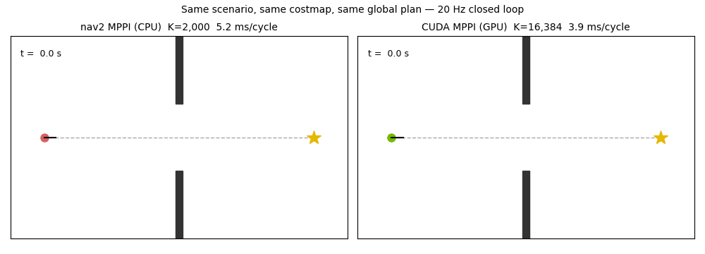
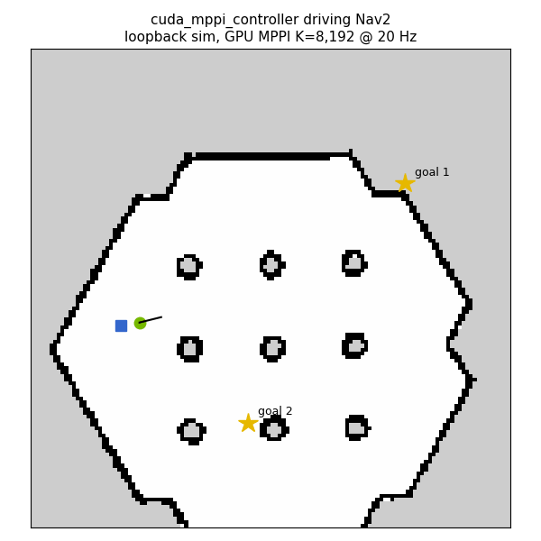

# cuda_mppi_controller

GPU-accelerated MPPI controller plugin for [Nav2](https://docs.nav2.org/).
A drop-in alternative to `nav2_mppi_controller` that runs every sampled
trajectory rollout on the GPU — **1 CUDA thread = 1 trajectory**, the same
parallel pattern used across [CudaRobotics](https://github.com/rsasaki0109/CudaRobotics).

Because rollouts are embarrassingly parallel, sample counts that are
impractical on CPU stay comfortably inside a 20 Hz control budget:

| batch_size (K) | mean solve time | max | control budget @ 20 Hz |
|---:|---:|---:|---:|
| 2,048  | 0.7 ms | 5.5 ms | 50 ms |
| 8,192  | 1.8 ms | 6.3 ms | 50 ms |
| 16,384 | 2.7 ms | 9.3 ms | 50 ms |
| 65,536 | 9.0 ms | 17.8 ms | 50 ms |

Measured with `mppi_gpu_standalone` (T=56, dt=0.05, 200×200 costmap upload
included) on an RTX 4070 Ti SUPER, ROS 2 Jazzy, CUDA 12.0. For reference,
the stock CPU MPPI controller typically runs K≈2,000; here K=65,536 still
fits the cycle with room to spare.

## Head-to-head vs nav2_mppi_controller (CPU)

`controller_benchmark` loads both controllers through pluginlib and drives
the same plant through the same costmap and plan at 20 Hz
(i9-10900 vs RTX 4070 Ti SUPER):

| | K=1–2k | K=5k | K=10k | K=16k | K=65k |
|---|---:|---:|---:|---:|---:|
| nav2 MPPI (CPU) mean | 2.0–4.3 ms | 10.6 ms | 20.7 ms | — | — |
| CUDA MPPI (GPU) mean | 1.0 ms | — | — | 2.8 ms | 8.3 ms |

Full setup, honest caveats (the stock CPU critic set still reaches the goal
~15% sooner in sim time — tuning, not architecture), and reproduction steps:
[`docs/results/cuda_mppi_vs_nav2_2026-06-10.md`](../../../docs/results/cuda_mppi_vs_nav2_2026-06-10.md).



## Status

Experimental, but verified end-to-end in the full Nav2 stack: bt_navigator →
planner_server → controller_server (this plugin) → velocity_smoother, driving
a TurtleBot3 through the sandbox world in the nav2 loopback simulation:



```bash
# terminal 1 — Nav2 + loopback sim with this plugin
ROS_DOMAIN_ID=42 PYTHONNOUSERSITE=1 ros2 launch nav2_bringup \
  tb3_loopback_simulation.launch.py use_rviz:=False \
  params_file:=$(ros2 pkg prefix cuda_mppi_controller)/share/cuda_mppi_controller/config/nav2_loopback_demo.yaml

# terminal 2 — waypoint mission + trajectory recording + GIF
ROS_DOMAIN_ID=42 PYTHONNOUSERSITE=1 python3 scripts/run_nav2_loopback_demo.py /tmp/nav2_demo
python3 scripts/render_nav2_loopback_demo.py /tmp/nav2_demo
```

(Gazebo physics simulation not exercised yet — the loopback sim covers the
full Nav2 software stack but not sensor pipelines.)

Differential-drive (`v`, `ω`) only for now. Costs implemented:

- **Path align** — squared lateral distance to the global plan window
- **Path follow** — distance to a point `follow_lookahead` ahead on the plan
  (pulls rollouts forward, like nav2's PathFollowCritic)
- **Goal** — linear terminal distance to the window end, yaw activates near
  the final goal
- **Costmap** — per-step lookup in the local costmap; lethal/inscribed cells
  add a collision penalty, inflated cells add a graded cost
- **Smoothness / backward motion / control limits**

Not yet implemented: footprint (robot is treated as a point — use an
inflated costmap), Ackermann/omni motion models, retreat behaviors.

## Build

```bash
cd ros2_ws
colcon build --packages-select cuda_mppi_controller --cmake-args -DCMAKE_BUILD_TYPE=Release
source install/setup.bash
```

Requires ROS 2 Jazzy (or any distro shipping `nav2_core`), CUDA Toolkit >= 12,
and an NVIDIA GPU.

## Verify without a robot

```bash
# pluginlib discovery, exactly how controller_server loads it
ros2 run cuda_mppi_controller plugin_load_test

# closed-loop synthetic scenario (wall with a gap) + solve-time report
ros2 run cuda_mppi_controller mppi_gpu_standalone           # default K=2048
ros2 run cuda_mppi_controller mppi_gpu_standalone 16384     # K sweep
```

## Use with Nav2

Point `controller_server` at the plugin (see
[`config/cuda_mppi_params.example.yaml`](config/cuda_mppi_params.example.yaml)):

```yaml
controller_server:
  ros__parameters:
    controller_plugins: ["FollowPath"]
    FollowPath:
      plugin: "cuda_mppi_controller::CudaMppiController"
      batch_size: 8192
      time_steps: 56
      model_dt: 0.05
```

### Parameters

| name | default | description |
|---|---:|---|
| `batch_size` | 2048 | sampled trajectories per cycle (1 CUDA thread each) |
| `time_steps` | 56 | horizon length |
| `model_dt` | 0.05 | [s] integration step |
| `iteration_count` | 1 | optimizer iterations per control cycle |
| `v_max` / `v_min` / `w_max` | 0.5 / -0.35 / 1.9 | control limits |
| `v_std` / `w_std` | 0.2 / 0.4 | sampling noise std |
| `temperature` | 0.35 | MPPI softmin λ |
| `goal_weight` | 20.0 | terminal local-goal distance (linear) |
| `goal_yaw_weight` | 3.0 | terminal yaw error near the final goal |
| `path_weight` | 2.0 | lateral deviation² from the plan |
| `path_follow_weight` | 5.0 | pull toward a point ahead on the plan |
| `follow_lookahead` | 0.6 | [m] how far ahead that point is |
| `costmap_weight` | 3.0 | graded cost for inflated cells |
| `smoothness_weight` | 0.2 | (Δu)² between consecutive steps |
| `backward_weight` | 0.5 | penalty on v < 0 |
| `yaw_goal_activation_dist` | 0.5 | [m] range to enable the yaw goal cost |
| `lookahead_dist` | 3.0 | [m] global plan window fed to the GPU |
| `transform_tolerance` | 0.1 | [s] TF lookup tolerance |

## Architecture

```
cuda_mppi_controller.cpp   nav2_core::Controller (ROS layer, no CUDA)
        │  PIMPL boundary
mppi_gpu.cu                rollout_kernel        1 thread = 1 trajectory
                           update_controls_kernel softmin-weighted average
```

The local costmap (raw `unsigned char` grid) is uploaded to the GPU each
cycle — at typical local costmap sizes this is tens of microseconds. The
nominal control sequence stays on the GPU between cycles (warm start).
